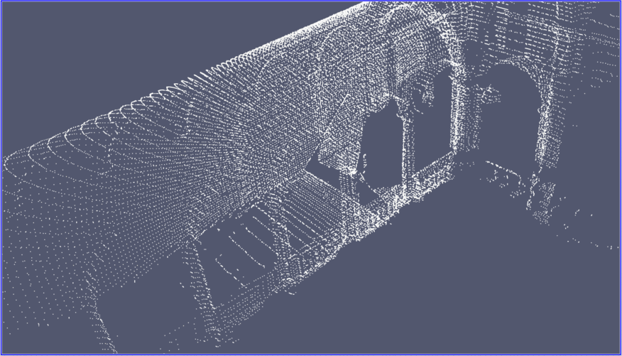

# octree-point-cloud-downsampler
A short project for downsampling point clouds using an octree.

## Instructions

After cloning this repo, run ``$ make`` in the directory. This should produce an executable named ``downsampler``. 

Simpy run the executable in the terminal, for example ``$ ./downsampler``. It will look for ``input.csv`` in the current directory and downsample it to produce ``output.csv``.

## Results 

Above shows a point cloud of a building with arches before and after being downsampled with my downsampler. It was about 70%+ points lost
for the 10 meter boundary. Data is from here: [LINK](https://projects.asl.ethz.ch/datasets/doku.php?id=laserregistration:eth_hauptgebaude:home)
